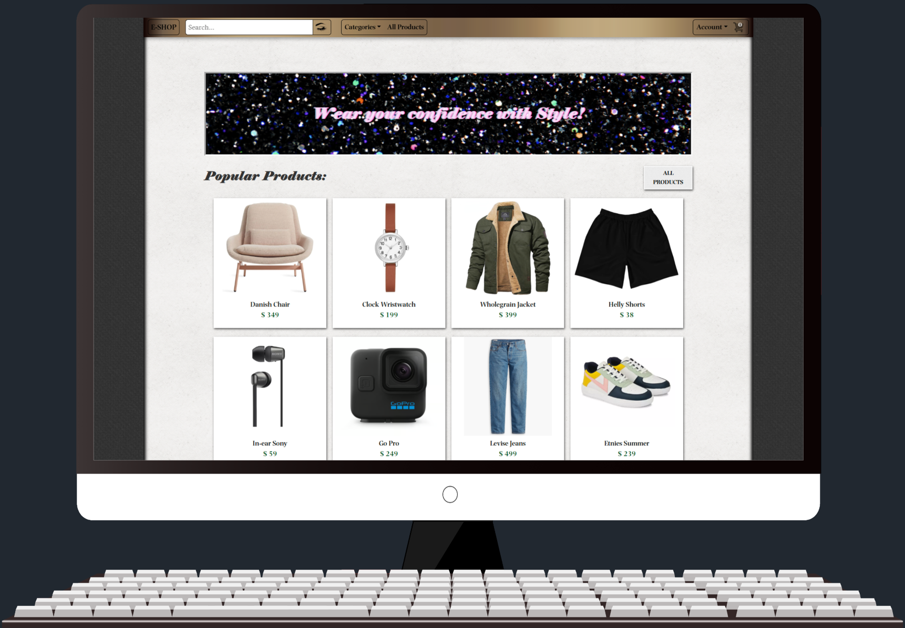
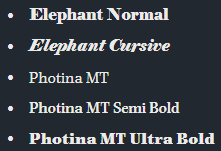

# **E-Shop**

**E-SHOP is a dynamic e-commerce platform offering a wide range of products — primarily clothing — with customizable options. Customers can browse items by category, size and color, or quickly locate specific products using the built-in search function in the navigation bar.**

**By registering, users can save their shipping details for faster future checkouts and gain access to a personal dashboard where all past orders, transactions, and receipts are stored in a clean, easy-to-read format.**

**With secure transaction processing, shoppers can make purchases with confidence and enjoy a smooth, user-friendly experience.**

[***See Live Project Here***](https://app-e-shop-c5039fdaf8fd.herokuapp.com/)

## **1. Project Goals**

**The goal of this project was to develop a fully functional and scalable e-commerce platform using Django, emphasizing modular design, secure deployment, and real-world integrations. The key objectives included:**

- Building the backend using Python and the Django framework to handle business logic, data management via ORM, and secure user authentication with a custom Django user model.

- Creating a responsive and user-friendly frontend using HTML5, CSS3, JavaScript, and the Bootstrap framework for styling and layout.

- Utilizing Django Templates for server-side rendering and dynamic content delivery.

- Implementing payment processing through integration with the PayPal SDK, enabling real-world transaction functionality.

- Managing static and media files locally during development and in production via AWS S3 for cloud storage.

- Securing cloud resources by managing access permissions with AWS IAM, ensuring proper authorization controls.

- Preparing the application for production deployment using Gunicorn as a reliable WSGI server.

- Using SQLite as a lightweight development database.

- Designing RESTful APIs and patterns to facilitate dynamic frontend and backend interactions.

- Employing environment variables (os.environ) for secure and flexible configuration management.

**These goals reflect a comprehensive approach to building a professional e-commerce system that balances frontend usability, backend robustness, and secure cloud deployment.**

## **2. User Goals:**

**The primary goal for users is to have a seamless and secure online shopping experience. E-SHOP is designed to provide:**

- An intuitive interface for browsing and searching products by category, size, and color.

- A smooth and responsive shopping experience across devices.

- Secure user registration and login, with access to a personal account area.

- The ability to manage profile information and reset passwords if needed.

- A personalized dashboard displaying past orders and transaction history.

- A fast and reliable checkout process with secure PayPal payment integration.

- Saved shipping details to simplify future purchases.

**Overall, E-SHOP aims to offer a clean, trustworthy, and convenient platform for purchasing customizable clothing and electronics online.**

## **3. User Stories:**

### **3.1. First-Time User Goals**

*(These users are new and unfamiliar with the site.)*

a) I want to quickly understand what this website offers.

b) I want to explore available items.

c) I want to easily search for a specific type of clothing.

### **3.2. Returning User Goals**

*(These users have visited before but may not be fully engaged or registered.)*

a) I want to view product details and reviews before purchasing.

b) I want to complete a purchase.

c) I want to register for an account to track my activity.

### **3.3. Frequent User Goals**

*(These users are active, likely registered, and returning regularly.)*

a) I want a faster, more streamlined checkout process.

b) I want to view and manage my past orders.

c) I want to update my personal or account details.

## **4. Design**

### **4.1 Fonts used in project**

### **4.2.1. Website Screenshots - Desktop**

**Click on the ">" to see images**

    
Home Page – The landing page greets visitors with a nostalgic, retro-style banner featuring a soft, blurred effect. Just below, it showcases the shop’s eight most popular items, giving a quick snapshot of what’s trending.

    

    
Products Page – Browse the full product range by category using the convenient filter box. Each page displays six items, with pagination controls allowing you to explore additional products beyond the first set.

    

    
Product Detail Page – View a detailed item description and customer reviews, select your preferred color and size, and add the product to your cart for purchase.

    

    
Cart Page - View and manage your cart items with options to add or remove products. See the subtotal, tax, and total amount updated in real time.

    

    
Checkout Page - Enter or confirm your shipping details (auto-filled for registered users) to complete your purchase.

    

    
Place order Page - Review your order and shipping details. Choose payment method.

    

    
Order Complete Page - After a successful transaction, you’re redirected here to view your order details. You will also recieve a confirmation email with your order number.

    

    
Dashboard Page - Your personal space showing your profile picture (if added), contact info, total orders, and a link to your order history.

    

    
My Orders Page - This page presents a detailed table of all your past orders, sorted by transaction date with the most recent first. Each order entry includes the Order Number, Billing Name, Phone Number, Total Cost, and Transaction Date, allowing you to easily track and review your purchase history in chronological order.

    

    
Order Details Page - Clicking an order number in “My Orders” opens this page, where you can view detailed information about that specific order, including the items purchased and other relevant order details.

    

    
Edit Profile Page - Manage your personal information effortlessly by updating your shipping details and adding or changing your profile picture—all in one convenient place to keep your account up to date.

    

    
Change Password Page - Easily boost your account security by updating your password anytime. Just enter your current password, then create and confirm a new one—keeping your account safe and giving you peace of mind.

    

    
Register Page - Create an account to start making purchases quickly and securely. You can add your shipping details later in your profile or during checkout for a smooth, personalized shopping experience.

    

    
Login Page - Sign in to your account to start shopping and complete purchases. Forgot your password? Simply click the “Forgot your password”.

    

    
Forgot your Password Page - Just add your registered email to reset your password. 

    

### **4.2.1. Website Screenshots - Smartphone**

    
Home Page

    

    
Products page

    

    
Product Details Page

    

    
Cart Page

    

    
Checkout Page

    

    
Place Order Page

    

    
Order Complete Page

    

    
Order Details Page

    

    
Dashboard Page

    

    
My Orders Page

    

    
Edit Profile Page

    

    
Change Password Page

    

    
Register Page

    

    
Login Page

    

    
Forgot your Password Page

    

### **5. Technologies Used:**

## 5.1 Languages Used:
* **[HTML5](https://en.wikipedia.org/wiki/HTML5)** - Markup language used for structuring web pages.
* **[CSS](https://en.wikipedia.org/wiki/Cascading_Style_Sheets)** - Styling language used for the presentation of the HTML elements.
* **[Python](https://www.python.org/)** - Programming language used for the backend of the application.
* **[SQL](https://en.wikipedia.org/wiki/SQL)** - Used for database queries (e.g., in SQLite or PostgreSQL databases).

## 5.2 Frameworks, Libraries & Programs Used:

### 5.2.1 Frameworks:
* **[Django](https://www.djangoproject.com/)** - High-level Python web framework for rapid development.
* **[Django Cloudinary Storage](https://django-cloudinary-storage.readthedocs.io/en/latest/)** - Integration with Cloudinary for media file management.
* **[Django Storages](https://django-storages.readthedocs.io/)** - Integration with different cloud storage solutions like AWS S3.

### 5.2.2 Libraries:
* **[requests](https://requests.readthedocs.io/)** - Library for making HTTP requests.
* **[django-environ](https://django-environ.readthedocs.io/)** - Configuration management library for reading environment variables.
* **[dj-database-url](https://pypi.org/project/dj-database-url/)** - Simplifies database configuration using URL format.
* **[boto3](https://boto3.amazonaws.com/v1/documentation/api/latest/index.html)** - AWS SDK for Python to interact with AWS services.
* **[Pillow](https://python-pillow.org/)** - Python Imaging Library for image processing.
* **[pyyaml](https://pyyaml.org/)** - YAML parser and emitter for Python.

### 5.2.3 Development Tools:
* **[Visual Studio Code](https://code.visualstudio.com/)** - Code editor used for development.
* **[GitHub Desktop](https://desktop.github.com/)** - GitHub client for managing repository and version control.
* **[GitHub](https://github.com/)** - Platform for version control and collaboration.
* **[Heroku](https://www.heroku.com/)** - Platform for deploying and running the app.
* **[ElephantSQL](https://www.heroku.com/)** - Database - Save user actions.
* **[Amazon AWS](https://aws.amazon.com/)** - Cloud services used for storage (static and media).
* **[PayPal](https://paypal.com/)** - Transaction Service.
* **[Postman](https://www.postman.com/)** - API testing tool.
* **[Agile Development](https://www.opentext.com/what-is/agile-development#:~:text=Agile%20development%20is%20a%20project,twelve%20principles%20of%20Agile%20development.)** - Aimed to work in accordance to Agile Development.

### 5.2.4 Other Libraries & Tools Used:
* **[Google Gmail](https://mail.google.com/)** - Used for email services (account and password verification).
* **[Temp Mail](https://temp-mail.org/)** - For creating temporary email accounts used for testing purposes.
* **[Bootstrap 5.0.2](https://getbootstrap.com/docs/5.0/getting-started/introduction/)** - Framework for responsive web design and styling.
* **[jQuery 3.7.1](https://jquery.com/)** - Library for manipulating the HTML DOM.
* **[Font Awesome](https://fontawesome.com/)** - Icons used throughout the application.
* **[Fontspace](https://www.fontspace.com/)** & **[1001Fonts](https://www.1001fonts.com/)** - Sources for fonts used in the design.
* **[Freepik](https://www.freepik.com/)** - Used for sourcing background images and other assets.
* **[Balsamiq Wireframes](https://balsamiq.com/wireframes/)** - Wireframing tool used in the design phase of the project.
